# AnchorAlpha Momentum Screener — Architecture

## Code-Level Architecture Diagram

Every box maps to an actual source file in the repo.

```mermaid
flowchart TD
    %% ─── TRIGGER ───────────────────────────────────────────────
    EB["☁️ AWS EventBridge\nCron: Mon-Fri 4:30PM EST\ninfrastructure/cloudformation/\nanchor-alpha-infrastructure.yaml"]

    %% ─── ENTRY POINT ────────────────────────────────────────────
    HANDLER["🚀 lambda_handler(event, context)\nsrc/AnchorAlpha/lambda_function/handler.py\n\nEntry point. Reads event from EventBridge.\nCreates LambdaOrchestrator and calls\nexecute_pipeline()"]

    %% ─── SECRETS ────────────────────────────────────────────────
    SM["🔐 AWS Secrets Manager\nFMP_API_KEY\nPERPLEXITY_API_KEY\n\nKeys injected as env vars\nby CloudFormation template"]

    %% ─── ORCHESTRATOR ───────────────────────────────────────────
    ORCH["🎯 LambdaOrchestrator\nsrc/AnchorAlpha/lambda_function/handler.py\n\nCoordinates all 6 pipeline steps.\nHolds references to all clients.\nPublishes final metrics."]

    %% ─── STEP 1: STOCK FETCH ────────────────────────────────────
    FMP_CLIENT["� FMPClient\nsrc/AnchorAlpha/api/fmp_client.py\n\nget_large_cap_stocks()\n→ calls /stable/profile?symbol=X\n→ calls /stable/quote?symbol=X\nfor ~60 hardcoded large-cap symbols\n\nRateLimiter: 300 req/min"]

    FMP_API["🌐 FMP API\nfinancialmodelingprep.com/stable\n\nReturns: price, marketCap,\nsector, companyName"]

    %% ─── STEP 2: HISTORICAL PRICES ──────────────────────────────
    HIST["📊 get_historical_prices(symbol, days=100)\nsrc/AnchorAlpha/api/fmp_client.py\n\nCalls /stable/historical-price-full/{symbol}\nReturns 100 days of OHLCV data\nper stock"]

    %% ─── STEP 3: MOMENTUM CALC ──────────────────────────────────
    MOMENTUM["⚙️ MomentumEngine\nsrc/AnchorAlpha/momentum_engine.py\n\nprocess_stock_batch()\n→ calculates returns:\n  momentum_7d  = (price_now - price_7d_ago)  / price_7d_ago\n  momentum_30d = (price_now - price_30d_ago) / price_30d_ago\n  momentum_60d = (price_now - price_60d_ago) / price_60d_ago\n  momentum_90d = (price_now - price_90d_ago) / price_90d_ago\n\nget_comprehensive_rankings()\n→ sorts stocks by momentum per tier"]

    %% ─── STEP 4: MODELS ─────────────────────────────────────────
    MODELS["🗂️ Stock Model\nsrc/AnchorAlpha/models.py\n\nFields: ticker, company_name,\ncurrent_price, market_cap,\nmomentum_7d/30d/60d/90d,\nai_summary, tier\n\nget_tier() → assigns to\n100B-200B / 200B-500B /\n500B-1T / 1T+"]

    %% ─── STEP 5: AI SUMMARIES ───────────────────────────────────
    PERP_FACTORY["🏭 PerplexityFactory\nsrc/AnchorAlpha/api/perplexity_factory.py\n\ncreate_client(use_mock=False)\n→ returns real or mock client"]

    PERP_CLIENT["🤖 PerplexityClient\nsrc/AnchorAlpha/api/perplexity_client.py\n\ngenerate_stock_summary(ticker, name, momentum)\n→ POST api.perplexity.ai/chat/completions\nTop 5 stocks per tier/timeframe"]

    PERP_MOCK["🧪 MockPerplexityClient\nsrc/AnchorAlpha/api/mock_perplexity_client.py\n\nUsed when PERPLEXITY_API_KEY missing\nReturns canned summaries"]

    PERP_API["🌐 Perplexity AI API\napi.perplexity.ai\n\nReturns: natural language\nmomentum analysis per stock"]

    %% ─── STEP 6: STORAGE ────────────────────────────────────────
    PIPELINE["🗄️ MomentumDataPipeline\nsrc/AnchorAlpha/storage/data_pipeline.py\n\nprocess_and_store_momentum_data(stocks, date)\n→ serialises ranked stocks to JSON\n→ calls S3DataStorage.upload_momentum_data()"]

    S3_CLIENT["☁️ S3DataStorage\nsrc/AnchorAlpha/storage/s3_client.py\n\nupload_momentum_data(date, data)\ndownload_momentum_data(date)\nlist_available_dates(limit)\nvalidate_json_schema(data)"]

    S3["🪣 AWS S3 Bucket\nanchor-alpha-momentum-data-prod\n\nPath: momentum-data/YYYY-MM-DD/\n        processed_data.json\n90-day lifecycle expiry\nAES-256 encryption"]

    %% ─── MONITORING ─────────────────────────────────────────────
    LOGGING["📝 StructuredLogger\nsrc/AnchorAlpha/utils/logging_utils.py\n\nlog_processing_metrics()\nlog_s3_operation()\napi_call_timer()\nfinalize_and_log_metrics()\n→ writes to CloudWatch Logs"]

    API_MON["📡 APIMonitor\nsrc/AnchorAlpha/utils/api_monitoring.py\n\ncheck_rate_limit(api_name)\npublish_metrics_to_cloudwatch()\nsave_usage_report_to_s3(bucket)\nTracks FMP + Perplexity usage"]

    CW["📊 CloudWatch\nAlarm: Lambda Errors > 1\nAlarm: Duration > 10min\nLog Group: /aws/lambda/\nanchor-alpha-momentum-processor-prod"]

    SNS["📧 SNS Topic\nanchor-alpha-notifications-prod\n→ email: satishraju.info@gmail.com"]

    SQS["💀 SQS Dead Letter Queue\nanchor-alpha-errors-prod\nCaptures failed invocations\n14-day retention"]

    BUD["💰 AWS Budget\n$10/month cap\nAlert at 80%"]

    %% ─── FRONTEND ───────────────────────────────────────────────
    DASH["🖥️ momentum_dashboard.py\nsrc/AnchorAlpha/streamlit_app/\nmomentum_dashboard.py\n\nMain Streamlit app entry point.\nOrchestrates all UI components."]

    DATA_LOADER["📥 StreamlitDataLoader\nsrc/AnchorAlpha/streamlit_app/data_loader.py\n\nload_latest_momentum_data()\nload_momentum_data_by_date(date)\nget_available_dates()\ntransform_data_for_ui(raw_data)\n@st.cache_data TTL=5min"]

    DATA_TRANSFORMS["🔄 data_transforms.py\nsrc/AnchorAlpha/streamlit_app/\ndata_transforms.py\n\nFormats momentum % for display\nBuilds pandas DataFrames\nfor charts and tables"]

    UI_COMP["🎨 ui_components.py\nsrc/AnchorAlpha/streamlit_app/\nui_components.py\n\nrender_tier_tabs()\nrender_stock_card()\nrender_momentum_chart()\nrender_timeframe_selector()"]

    STYLING["💅 styling.py\nsrc/AnchorAlpha/streamlit_app/\nstyling.py\n\nCSS injection\nColour themes\nCard styles"]

    USER["👤 User Browser\nLightsail Container\nPort 8501"]

    %% ─── FLOW ───────────────────────────────────────────────────
    EB -->|"invoke Lambda"| HANDLER
    HANDLER --> SM
    SM -->|"FMP_API_KEY\nPERPLEXITY_API_KEY"| ORCH

    ORCH -->|"Step 1: fetch stocks"| FMP_CLIENT
    FMP_CLIENT -->|"GET /stable/profile\nGET /stable/quote"| FMP_API
    FMP_API -->|"stock data"| FMP_CLIENT
    FMP_CLIENT -->|"List[Dict]"| MODELS

    ORCH -->|"Step 2: historical prices"| HIST
    HIST -->|"GET /stable/historical-price-full"| FMP_API
    FMP_API -->|"100 days OHLCV"| HIST
    HIST -->|"HistoricalPriceData"| MOMENTUM

    MODELS -->|"Stock objects"| MOMENTUM
    ORCH -->|"Step 3+4: calc + rank"| MOMENTUM
    MOMENTUM -->|"ranked tiers"| ORCH

    ORCH -->|"Step 5: AI summaries"| PERP_FACTORY
    PERP_FACTORY -->|"key present"| PERP_CLIENT
    PERP_FACTORY -->|"no key"| PERP_MOCK
    PERP_CLIENT -->|"POST chat/completions"| PERP_API
    PERP_API -->|"summary text"| PERP_CLIENT
    PERP_CLIENT -->|"ai_summary → Stock"| ORCH

    ORCH -->|"Step 6: store"| PIPELINE
    PIPELINE -->|"serialised JSON"| S3_CLIENT
    S3_CLIENT -->|"PutObject"| S3

    ORCH --> LOGGING
    ORCH --> API_MON
    LOGGING -->|"structured logs"| CW
    API_MON -->|"custom metrics"| CW
    CW -->|"alarm"| SNS
    BUD -->|"cost alert"| SNS
    ORCH -->|"on failure"| SQS

    USER -->|"HTTP"| DASH
    DASH --> DATA_LOADER
    DATA_LOADER -->|"GetObject"| S3_CLIENT
    S3_CLIENT -->|"GetObject"| S3
    DATA_LOADER --> DATA_TRANSFORMS
    DATA_TRANSFORMS --> UI_COMP
    UI_COMP --> STYLING
    STYLING -->|"rendered page"| USER
```



---

## Component → File Reference

| Component | File |
|-----------|------|
| Lambda entry point | `src/AnchorAlpha/lambda_function/handler.py` |
| Pipeline orchestrator | `src/AnchorAlpha/lambda_function/handler.py` → `LambdaOrchestrator` |
| Stock data model | `src/AnchorAlpha/models.py` |
| FMP API client | `src/AnchorAlpha/api/fmp_client.py` |
| Momentum calculations | `src/AnchorAlpha/momentum_engine.py` |
| Perplexity client | `src/AnchorAlpha/api/perplexity_client.py` |
| Perplexity mock | `src/AnchorAlpha/api/mock_perplexity_client.py` |
| Perplexity factory | `src/AnchorAlpha/api/perplexity_factory.py` |
| S3 storage client | `src/AnchorAlpha/storage/s3_client.py` |
| Data pipeline | `src/AnchorAlpha/storage/data_pipeline.py` |
| Structured logging | `src/AnchorAlpha/utils/logging_utils.py` |
| API rate monitoring | `src/AnchorAlpha/utils/api_monitoring.py` |
| Streamlit app | `src/AnchorAlpha/streamlit_app/momentum_dashboard.py` |
| S3 data loader | `src/AnchorAlpha/streamlit_app/data_loader.py` |
| Data transforms | `src/AnchorAlpha/streamlit_app/data_transforms.py` |
| UI components | `src/AnchorAlpha/streamlit_app/ui_components.py` |
| Styling | `src/AnchorAlpha/streamlit_app/styling.py` |
| CloudFormation infra | `infrastructure/cloudformation/anchor-alpha-infrastructure.yaml` |

---

## Data Flow Summary

```
EventBridge (cron)
  → handler.py::lambda_handler()
    → LambdaOrchestrator::execute_pipeline()
      → fmp_client.py::get_large_cap_stocks()        # ~60 stocks, profile+quote
      → fmp_client.py::get_historical_prices()        # 100 days per stock
      → momentum_engine.py::process_stock_batch()     # 7d/30d/60d/90d returns
      → momentum_engine.py::get_comprehensive_rankings() # sort by tier
      → perplexity_client.py::generate_stock_summary() # AI text per top stock
      → data_pipeline.py::process_and_store_momentum_data()
        → s3_client.py::upload_momentum_data()        # JSON → S3

User Browser
  → momentum_dashboard.py (Streamlit)
    → data_loader.py::load_latest_momentum_data()
      → s3_client.py::download_momentum_data()        # JSON ← S3
    → data_transforms.py                              # format for display
    → ui_components.py + styling.py                   # render to browser
```
